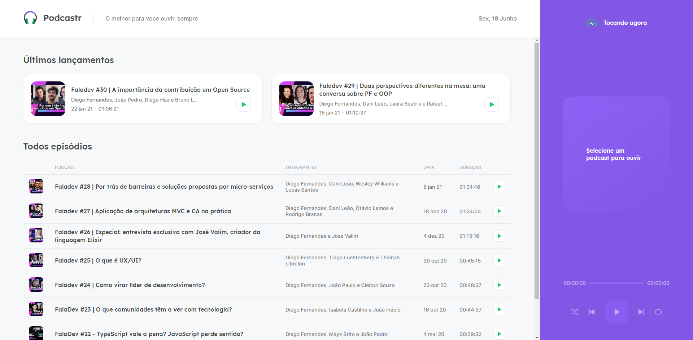

<div align="center">
  
  <h1 align="center">The best podcasts for you</h1>
  <hr />
</div>




## About 🔎:
#### This APP provides multiple features, such as:
- Listen to an episode;
- Go next and previous episodes;
- Set shuffle and loop;
- Go to any time in the episode by using the slider;
- See the episode description;
- The page of the episode description is static using the next function: getStaticProps;
<hr />

## Technologies 💻:
- React
- NextJS
- Context API
- RC-Slider
- Date-fns
- JSON Server
- Axios
- SASS

## How to Run 🚀:
```bash
# Clone this repository
$ git clone https://github.com/EduardoBravoP/podcastr.git

# Go into the repository
$ cd podcastr

# Install dependencies
$ yarn

# Run the JSON Server
$ yarn server

# Run the app on development mode
$ yarn dev

# And it's ready on localhost:3000

# If you want to generate the build of the project
$ yarn build

# And start the application
$ yarn start

# And it's ready on localhost:3000
```